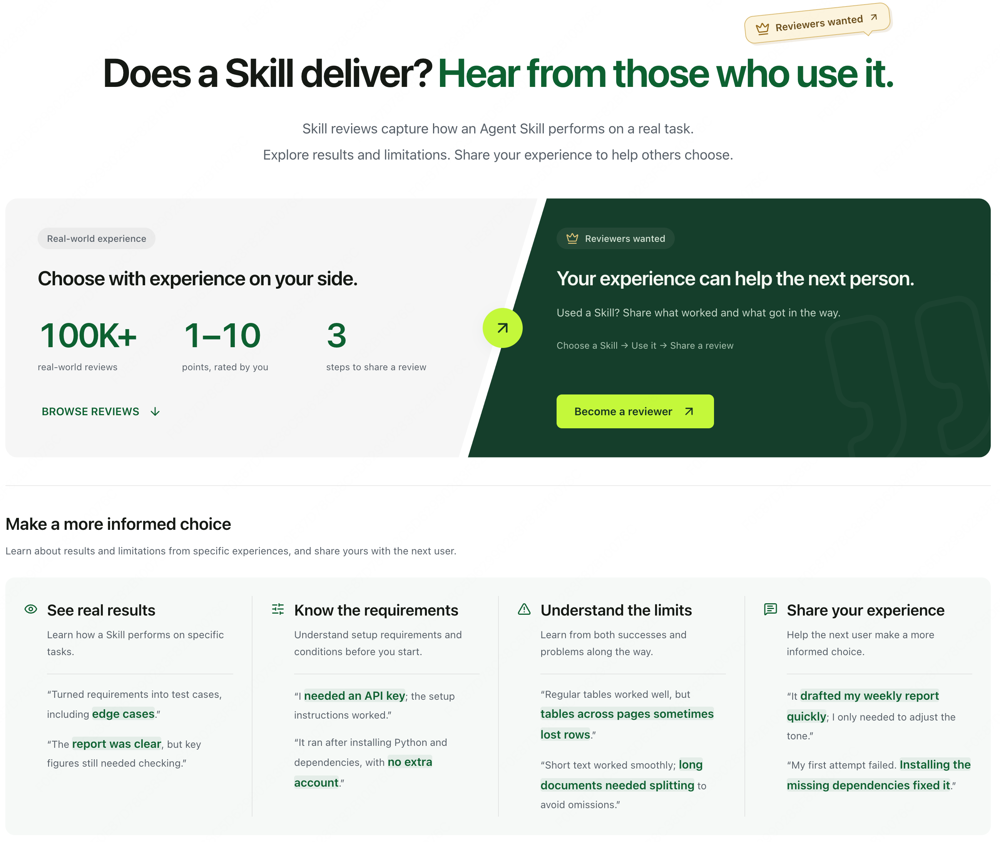

<div align="center">

# deep-skill-finder

**Real Tests, Real Reviews find skills that Real Work**

*An Agentic skill discovery engine. Your Claude Code / Codex / OpenClaw / Cursor auto-discovers the right skill from a 200k+ ecosystem — for every task.*


[](LICENSE)
[](#ecosystem-status)
[](https://www.deepskill.market/skill)

English | [中文](README.zh.md)

</div>

---

## 🚀 Install in your Agent (30 seconds)

Copy this prompt, send it to your Agent (Claude Code / Codex / OpenClaw / Cursor / 40+ supported):

```
Please install the deep-skill-finder skill: download from
https://www.deepskill.market/api/v1/skill-finder, extract to local skills
directory, and enable it.
```

That's it — install typically completes in 15-30 seconds. Don't like it? [Uninstall anytime](#uninstall--list) with one command. Next time your Agent needs a skill, DSF will find candidates and ask you before installing.

### Use

Talk to your Agent naturally. When a task needs an external Skill, DSF triggers automatically:

```
"Find me a skill that builds interactive dashboards from a CSV"
"Is there a skill for pulling stock market data?"
"Recommend a skill for translating technical docs into plain English"
"Set up a CI/CD pipeline that runs on every PR"
```

DSF returns a ranked TOP-5 with reasons. Confirm a number → installation completes automatically.

---

## Why deep-skill-finder

The Skill ecosystem is growing fast. The problem is no longer a lack of tools — it's increasingly hard to tell: **which Skill truly fits my specific task?**

Traditional Skill directories show names, creator descriptions, downloads, and stars. These tell you whether a Skill is discoverable or popular, but they can't answer:

- Has it actually run on tasks like yours? How were the results, latency, and token cost?
- Which Agents, environments, and workflows does it fit? Does it need extra credentials or complex setup?
- Where does it fail?

Every Skill describes what it claims to do; few tell you how it actually behaves. The real problem isn't just "can I find it" — after finding candidates, you still lack grounds to choose:

- **Relevant is not the same as suitable.** A Skill's name and description suggest what it *might* do, not whether it actually works well in your specific Agent, task, and environment.
- **Real performance depends on the scenario.** The same Skill can produce completely different results across tasks, Agents, and environments. Context-free generic ratings rarely help you judge fit.
- **Popularity is not performance.** Downloads and stars reflect attention, not whether a Skill runs, the quality of its output, or where it has failed in real scenarios.

## deep-skill-finder vs Others

**deep-skill-finder combines professional retrieval with real-scenario feedback.** It first understands your task and constraints to find genuinely relevant candidates from the whole-Skill web; then draws on real usage feedback from similar tasks to help you make the final choice.

| Typical Skill directory | deep-skill-finder |
| --- | --- |
| Search by name, tags, and keywords | Understands task intent, capability direction, and execution conditions |
| Shows the creator's self-description | Adds real usage feedback: actual performance, execution results, key facts |
| Measures popularity with downloads and stars | Shows real performance across specific tasks, Agents, and environments |
| Rarely shows runs, failures, and output quality | Synthesizes success/failure records, output quality, latency, and cost |
| Tells you "what everyone is looking at" | **Through real application cases**, tells you how a Skill actually performed "in similar scenarios" |

## Skill Review
deep-skill-finder introduces a dedicated **real-user review** module — not context-free star ratings; one review centers on a concrete task.



> A skill review records the usage scenario, Skill performance, and the rating, plus context such as Agent type, occurrence time, and estimated token usage.       
> Images or videos can be attached when needed: small files go inline in the feedback JSON, while larger files upload to object storage via a server-issued presigned URL — only the file name is submitted, never the local path.

A complete Skill-execution feedback record contains:
```
usageScenario (usage context)

Add a skill-review and experience-gallery module to an existing Vue 3 + Vite app, reusing the existing navigation, theme, and responsive style, while keeping pages, presentation components, APIs, state management, and data access independent — with type checks, tests, and a production build all passing.

skillPerformance (how the Skill performed)

vue-patterns provided conventions for feature-first directory organization, the Composition API, container/presentation component separation, reactive state selection, lazy-loaded routes, and testing. The implementation followed it to split out route pages, dedicated presentation components, a server-state composable, the API, types, and a local repository; server data is managed with Vue Query and components communicate via typed props/emit. The code passed ESLint, type checks, module tests, and the production build — no exceptions, timeouts, or retries attributable to the Skill itself were observed. The Skill does not cover the existing product's visual spec, business interaction design, or browser acceptance testing; those parts still required reading the existing code and human judgment.

userFeedback (user review)
9/10 — this skill showed solid UI style consistency; well suited for front-end work that adds new pages or modules

Attachments (optional)
Screenshots, screen recordings, and other image/video files
```

This real-review information helps surface Skills that are more suitable, safer, and more effective — and helps users **spot risks in advance**. See 3 real cases below ↓

---

## See it in action · 3 real cases

**Case 1 · GitHub Actions CI/CD**
> Others found: `github-actions-gen` — sparse docs, runtime bugs
> DSF found: `cicd-pipeline-generator` — detailed docs with copy-paste examples, runs clean

**Case 2 · Stock market data (龙虎榜)**
> Others found: `pywencaistock` — all data endpoints down
> DSF found: `lhb-api` — purpose-built for this data source, 3 API calls all passed

**Case 3 · Blog translation (GPT-4o → Chinese)**
> Others found: `translation-pro` — translation correct but too stiff, not "accessible" style
> DSF found: `blog-polish-zhcn` — translation + polish + term retention, done in 175 seconds

---

## How it works: professional retrieval + real reviews, 8 layers of ranking

deep-skill-finder's recommendation is not a single keyword ranking — it runs in two stages:
> 1. **Professional retrieval**: understand the task the user actually wants done, and find capability-relevant, direction-correct, execution-ready candidates from across the web.
> 2. **Real-review ranking**: put candidates back into concrete usage scenarios, and combine real users' execution process, results, and reviews to judge which Skill fits the current task best.

```
User describes the task in natural language
              │
              ▼
    Task understanding & query rewrite
 (goal · I/O · direction · constraints · environment)
              │
              ▼
┌──────────────────────────────────────────┐
│  Professional retrieval (coarse):        │
│           multi-channel recall           │
│                                          │
│  ① Skill metadata similarity recall      │
│  ② SKILL.md / description content recall │
│  ③ Feedback real-review similarity recall│
└──────────────┬───────────────────────────┘
               │
               ▼
      Merge · dedupe · coarse ranking
               │
               ▼
┌──────────────────────────────────────────┐
│     Fine rank: Rerank + review check     │
│                                          │
│  Task match: capability · direction ·    │
│               completeness               │
│  Execution: environment · dependencies · │
│              feasibility                 │
│                                          │
│  Real-review verification:               │
│    usageScenario   similar context       │
│    skillPerformance process & results    │
│    userFeedback    rating & sentiment    │
│                                          │
│  Synthesize success, failure, quality,   │
│  risk & cost                             │
└──────────────┬───────────────────────────┘
               │
               ▼
  TOP 5 + reasons + scenario evidence + risks
               │
               ▼
      User confirms → install → execute
                         │
                         ▼
           User voluntarily leaves a review
                         │
                         ▼
                     Redaction
                         │
                         ▼
             New real-review evidence
                         │
                         ├────→ Feedback similarity recall
                         └────→ Rerank review verification
```

### Stage 1: find relevant candidates through professional retrieval

1. **Task-intent understanding** — identify the user's real goal, plus inputs, outputs, workflow direction, and environment requirements.
2. **Capability & direction matching** — prioritize structured capability data, distinguishing "A → B" from "B → A" to avoid false hits on keyword similarity.
3. **Execution-condition check** — does the Skill need extra credentials, complex setup, or a specific runtime; can it cover the full task.
4. **Fundamental-conflict filtering** — remove candidates whose capability direction, usage conditions, or task goals clearly conflict.

### Stage 2: re-judge and re-rank through real reviews

5. **Similar-scenario priority** — compare `usageScenario` in reviews. The closer the task goal, Agent type, and environment to your current need, the higher the review's reference value.
6. **Real execution results** — analyze `skillPerformance`: did the Skill actually run, which steps did it complete, did it pass tests, builds, or result verification.
7. **Output quality & user sentiment** — combine `userFeedback` to judge whether the output meets quality, style, and business requirements — not just "ran successfully".
8. **Risk, limits, and cost** — surface dead endpoints, exceptions, timeouts, extra dependencies, capability boundaries, latency, and token cost from reviews, demoting high-risk candidates.

### How do real reviews affect the final ranking?

DSF doesn't simply sort by score. A review must first match the current task scenario before it counts as evidence:

- Execution feedback from similar tasks beats high scores from irrelevant scenarios;
- Feedback with a clear execution process and verified results is more credible than a generic "works great";
- Successful runs, result quality, and user endorsement strengthen a recommendation;
- Dead endpoints, environment conflicts, and explicit failure records demote or filter candidates;
- Downloads are only a tie-breaker when capability and real performance are close — they never override real execution evidence.

Finally, DSF synthesizes professional retrieval with real reviews into at most 5 high-confidence recommendations, explaining:

- why it fits the current task;
- what similar scenarios it has run in;
- how it actually performed and what users said;
- what risks to note before install or execution.

**Professional retrieval answers "which Skills might fit"; real reviews answer "which Skills have proven themselves in similar scenarios."**

Real reviews work twice in the recommendation pipeline:

- **Recall stage:** feedback is a third recall channel, surfacing Skills that are hard to find by name or description but have actually been used in similar tasks.
- **Rerank stage:** the reranker uses usage scenario, execution performance, and user feedback to verify whether candidates truly fit the current task, adjusting ranking by success, failure, quality, risk, and cost.

This forms a complete recommendation loop: **task understanding → multi-channel recall → merge & coarse ranking → rerank verification → user confirmation → install & execute → real-review backflow**.

Every real usage a user is willing to share is more than a download number. It helps the system discover more Skills that fit similar tasks, and becomes evidence of real performance for the next ranking.

---

## Ecosystem status

deep-skill-finder works out of the box across **40+ Agent runtimes** — no matter which Agent you use, it fits:

- Claude Code · Codex · Cursor · Windsurf · Cline
- WorkBuddy · OpenClaw · CatDesk · Hermes
- Copilot · Gemini · Antigravity · Amp
- + 28 more

**30-day active data** *(2026-08 · updated monthly)*:
- 40+ distinct `agentType` clients calling DSF
- **Top skills installed by real users through DSF** (each verified by 10+ distinct client installations):
  - `desktop-pet` (116 clients) · `ppt-maker` (115) · `product-compare` (102) · `business-plan` (81) · `amazon-a-plus-content` (78)

---

## Project structure

```
├── .gitignore                      # Git ignore rules
├── README.md                       # English documentation
├── README.zh.md                    # Chinese documentation
├── SKILL.md                        # Skill definition & full Agent workflow
├── assets/                         # README visual assets
├── references/
│   └── skill-evaluation.md         # Real-use evaluation, confirmation & privacy spec
├── scripts/
│   ├── deep_skill_search.py        # Search & rank Skills via the retrieval service
│   ├── deep_skill_install.py       # Download, install & manage Skills
│   └── skill_feedback.py           # Evaluation discovery, redaction, validation, save & upload
└── tests/
    ├── test_deep_skill_search.py   # Search pipeline tests
    └── test_skill_feedback.py      # Real-evaluation pipeline & safety rule tests
```

## Scripts reference

Typically you don't call these directly — the Agent handles invocation. But you can run them standalone:

**Search:**
```bash
python3 scripts/deep_skill_search.py "your task description" [--agent-type openclaw]
```

Search failures return a non-zero exit status and a structured `error.code` such as
`search_timeout`, `search_network_error`, or `search_service_error`. A successful search with
no matches still exits normally with an empty `community` list.

### Uninstall & List

**Install / Uninstall / List:**
```bash
# Install
python3 scripts/deep_skill_install.py <skill-name> --dir ~/.catpaw/skills

# Uninstall
python3 scripts/deep_skill_install.py <skill-name> --dir ~/.catpaw/skills --uninstall

# List installed
python3 scripts/deep_skill_install.py --dir ~/.catpaw/skills --list
```

---

## Common questions

**Q: Isn't downloads/stars a good enough signal?**
A: Downloads and stars tell you what's *popular* — not what runs on *your specific task*. DSF ranks by capability match + real community runs. Download count acts only as a tie-breaker when capability and real performance are close — never as the primary signal.

**Q: How is real-scenario feedback different from ordinary ratings?**
A: Ordinary ratings compress experiences across different users, tasks, and environments into a single number. DSF preserves the scenario information that matters for judgment, so the Agent can tell whether a piece of feedback is actually relevant to your current task, environment, and goals.

**Q: Where does real-scenario feedback come from?**
A: From real executions and voluntary reviews by users who picked a Skill through DSF. Each review describes the specific usage scenario and the Skill's performance with the necessary run context — not just a generic thumbs-up or thumbs-down.

**Q: Will my full task logs be uploaded?**
A: No. Feedback content goes through deterministic redaction first, and the raw trajectory is never uploaded. See [Feedback & Privacy](#feedback--privacy) for exactly what is submitted.

**Q: "A skill that installs other skills" — is this recursion? Is it safe?**
A: No — DSF only *recommends* skills. Every install requires your explicit confirmation before anything happens on your machine. Each recommended skill passes security audit and quality checks before reaching you.

**Q: What if I already use SkillHub / ClawHub / Vercel find-skills?**
A: DSF works alongside them, not against. It multi-channel recalls across all major skill sources — SkillHub, ClawHub, GitHub, community test posts. Install DSF, try one task, decide from there.

**Q: Do I need an account?**
A: No. DSF works standalone — no signup, no email required, no telemetry beyond an anonymous local UUID for cross-session persistence.

**Q: Which Agents does it support?**
A: 40+ agent runtimes including Claude Code, Codex, OpenClaw, Cursor, Windsurf, Cline, WorkBuddy, Hermes, CatDesk, Copilot, and more.

---

## Contributing

Issues and pull requests are welcome.

### If you're a user
- If a specific Skill ranks too high or too low, the underlying signal lives in [Meyo Community](https://www.deepskill.market/community/home) — leaving real run records there is the most direct way to improve future rankings.
- Report issues or request coverage of specific tasks/domains via [Issues](https://github.com/wheelry/deep-skill-finder/issues).

### If you're a Skill creator
- We index Skills across the web to build the most comprehensive Skill discovery layer. If your Skill isn't showing up in DSF results, [open an issue](https://github.com/wheelry/deep-skill-finder/issues) with your Skill URL and we'll investigate.
- Interested in collaborating on a "Why I put my Skill on DSF" post? Reach out via Issues.

---

## Star History

[](https://star-history.com/#wheelry/deep-skill-finder&Date)

---

## Found this useful?

- ⭐ **[Star this repo](../../stargazers)** — help other Agent users discover DSF
- 💬 **[Open a Discussion](../../discussions)** — share your use case or ask questions
- 🐛 **[Report an Issue](../../issues)** — if a recommendation seems off, tell us
- 📖 **[Try DSF now](#-install-in-your-agent-30-seconds)** — 30 seconds to install

---

## License

MIT — free to use, modify, and distribute with attribution. See [LICENSE](LICENSE).

---

## Feedback & Privacy

When you choose to rate a Skill, we upload `usageScenario`, `skillPerformance`, `rating`, `comment`, and under `context`: `agentType`, `occurredAt`, `trajectoryIdHash`, and `estimatedTokenUsage`. You may also attach images or videos; small files are sent inline and larger files are uploaded directly to object storage via a presigned URL, with only the file name (not the local path) submitted.

All feedback content is first processed by a deterministic redaction script; the raw trajectory is never uploaded. `estimatedTokenUsage` is an integer estimate by the Agent of how many tokens the Skill execution consumed. It is not sensitive personal information, but it is submitted to the server along with the rest of the feedback.

---

## Related links

- **Landing page:** https://www.deepskill.market/skill
- **Community:** https://www.deepskill.market/community/skills
- **SkillHub listing:** https://skillhub.cn/skills/deep-skill-finder
- **ClawHub listing:** https://clawhub.ai/lintong123/skills/deep-skill-finder
