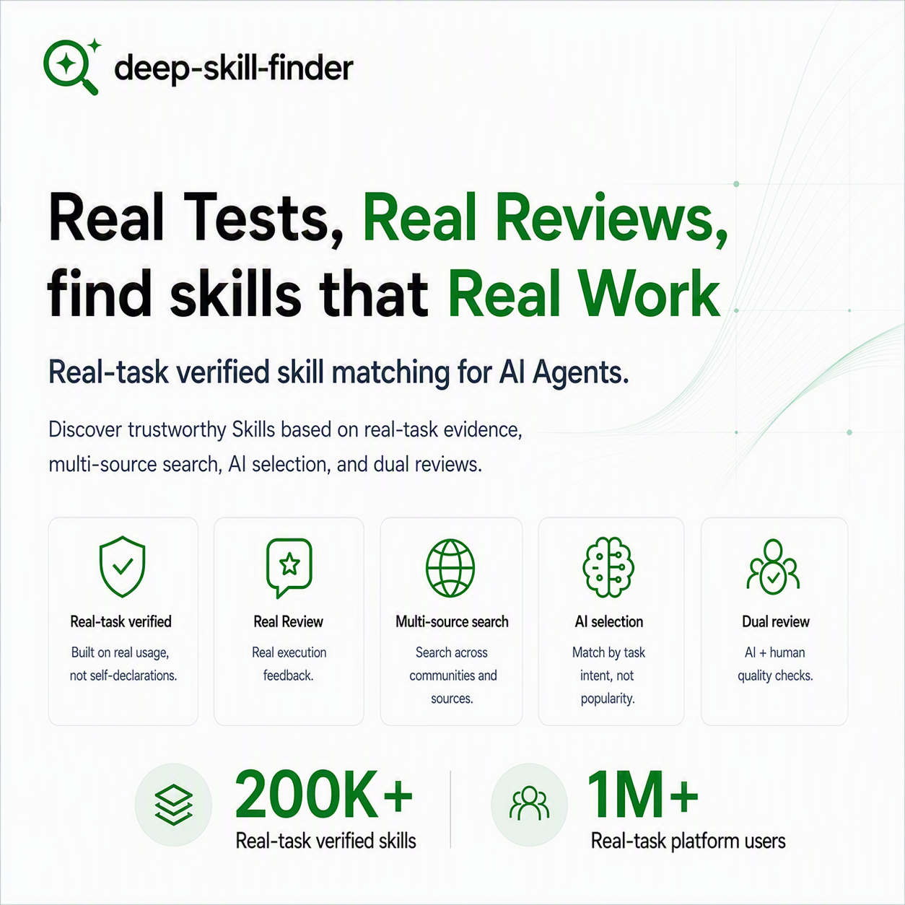

<div align="center">

# deep-skill-finder

**Install once. Your Agent picks the skill that runs — not the one that ranks.**

*An Agentic skill discovery engine. Your Claude Code / Codex / OpenClaw / Cursor auto-discovers the right skill from a 50k+ ecosystem — for every task.*



[](LICENSE)
[](#ecosystem-status)
[](https://www.meyo.life/skill)

English | [中文](README.zh.md)

</div>

---

## 🚀 Install in your Agent (30 seconds)

Copy this prompt, send it to your Agent (Claude Code / Codex / OpenClaw / Cursor / 40+ supported):

```
Please install the deep-skill-finder skill: download from
https://www.meyo.life/api/v1/skill-finder, extract to local skills
directory, and enable it.
```

That's it — install typically completes in 15-30 seconds. Don't like it? [Uninstall anytime](#scripts-reference) with one command. Next time your Agent needs a skill, DSF will find candidates and ask you before installing.

---

## Why deep-skill-finder

Using an Agent requires installing Skills. But which Skill actually works on **your specific task**?

**Two problems every Agent user hits:**

- **Can't find what you need.** Creators write broad, abstract descriptions to rank in more searches. Your specific need gets buried under noise.
- **Can't trust what you find.** Downloads and star ratings can't prove a Skill actually ran correctly. You install one, it crashes on your task, you uninstall, you try another. 20 minutes later, you're still looking.

**deep-skill-finder solves both.** Install once — your Agent handles Skill discovery, evaluation, and installation autonomously, ranking by real community runs and task-fit — not by download counts.

*See 3 real cases below ↓*

---

## See it in action · 3 real cases

**Case 1 · GitHub Actions CI/CD**
> Others found: `github-actions-gen` — sparse docs, runtime bugs
> DSF found: `cicd-pipeline-generator` — detailed docs with copy-paste examples, runs clean

**Case 2 · Stock market data (龙虎榜)**
> Others found: `pywencaistock` — all data endpoints down
> DSF found: `lhb-api` — purpose-built for this data source, 3 API calls all passed

**Case 3 · Blog translation (GPT-4o → Chinese)**
> Others found: `translation-pro` — translation correct but too stiff, not "accessible" style
> DSF found: `blog-polish-zhcn` — translation + polish + term retention, done in 175 seconds

---

## How it works 
> 8 layers of ranking intelligence and Final intelligence synthesis

deep-skill-finder goes beyond keyword matching. It evaluates every candidate through eight layers of judgment, prioritizing real capability and task fit over surface-level similarity.

1. **Meta-intent awareness** — When you are looking for a skill-discovery tool itself, deep-skill-finder recognizes that intent and puts the right meta-skill first.
2. **Capability-first matching** — Structured capability data takes priority over promotional descriptions, so rankings reflect what a skill can actually do.
3. **Intent-direction reasoning** — It understands that “A → B” is not the same as “B → A,” preventing reversed workflows from ranking highly.
4. **Execution readiness** — Relevant but impractical skills are demoted when they depend on hidden credentials, complex setup, or non-executable documentation.
5. **Multi-intent coverage** — For complex requests, skills that cover more of the end-to-end workflow rank above narrow, single-step tools.
6. **Community corroboration** — Community posts count only when they provide evidence aligned with the user’s actual intent.
7. **Contradiction filtering** — Fundamentally mismatched candidates are removed, even when they share similar keywords.
8. **Popularity in its proper place** — Download count helps break close ties, but never outweighs capability, direction, or task fit.
 
**Final intelligence synthesis** — A reasoning-driven reranker synthesizes every signal into a holistic final judgment, delivering up to five high-confidence recommendations with clear, decision-ready rationales.

---

## Ecosystem status

deep-skill-finder works out of the box across **40+ Agent runtimes** — no matter which Agent you use, it fits:

- Claude Code · Codex · Cursor · Windsurf · Cline
- WorkBuddy · OpenClaw · CatDesk · Hermes
- Copilot · Gemini · Antigravity · Amp
- + 28 more

**30-day active data** *(2026-08 · updated monthly)*:
- 40+ distinct `agentType` clients calling DSF
- **Top skills installed by real users through DSF** (each verified by 10+ distinct client installations):
  - `desktop-pet` (116 clients) · `ppt-maker` (115) · `product-compare` (102) · `business-plan` (81) · `amazon-a-plus-content` (78)

---

## Quick Start

### Prerequisites
- A running Agent (Claude Code / Codex / Cursor / any of the 40+ supported clients)

### Install in your Agent

Send this prompt directly to your Agent:

```
Please install the deep-skill-finder skill: download the skill package from
https://www.meyo.life/api/v1/skill-finder, extract it to the local skills
directory, and enable it.
```

The Agent handles download, extraction, and enablement automatically.

### Use

Talk to your Agent naturally. When a task needs an external Skill, DSF triggers automatically:

```
"Find me a skill that builds interactive dashboards from a CSV"
"Is there a skill for pulling stock market data?"
"Recommend a skill for translating technical docs into plain English"
"Set up a CI/CD pipeline that runs on every PR"
```

DSF returns a ranked TOP-5 with reasons. Confirm a number → installation completes automatically.

---

## Architecture

```
User describes task in natural language
            │
            ▼
    Intent understanding
  (rewrite → semantic query)
            │
            ▼
      Multi-channel recall
  ┌─────────┬──────────────┐
  │ Skill   │  Community   │
  │ profile │  test posts  │
  └────┬────┴──────┬───────┘
       └─────┬─────┘
             ▼
   8-rule semantic ranking
   → TOP 5 with reasons
             │
             ▼
   Confirm number → auto-install → run → feedback loop
```

Once installed, the loop runs autonomously: **identify → recall → confirm → execute → feedback**. Each match gets more accurate over time.

---

## Project structure

```
├── SKILL.md                  # Skill definition (Agent reads this)
└── scripts/
    ├── deep_skill_search.py  # Semantic search via Meyo retrieval service
    └── deep_skill_install.py # Download and install Skills locally
```

## Scripts reference

Typically you don't call these directly — the Agent handles invocation. But you can run them standalone:

**Search:**
```bash
python3 scripts/deep_skill_search.py "your task description" [--agent-type openclaw]
```

**Install / Uninstall / List:**
```bash
# Install
python3 scripts/deep_skill_install.py <skill-name> --dir ~/.catpaw/skills

# Uninstall
python3 scripts/deep_skill_install.py <skill-name> --dir ~/.catpaw/skills --uninstall

# List installed
python3 scripts/deep_skill_install.py --dir ~/.catpaw/skills --list
```

---

## Common questions

**Q: Isn't downloads/stars a good enough signal?**
A: Downloads and stars tell you what's *popular* — not what runs on *your specific task*. DSF ranks by capability match + real community runs. Ranking rule #8 explicitly caps download count as a tie-breaker only, never as the primary signal.

**Q: "A skill that installs other skills" — is this recursion? Is it safe?**
A: No — DSF only *recommends* skills. Every install requires your explicit confirmation before anything happens on your machine. Each recommended skill passes security audit and quality checks before reaching you.

**Q: What if I already use SkillHub / ClawHub / Vercel find-skills?**
A: DSF works alongside them, not against. It multi-channel recalls across all major skill sources — SkillHub, ClawHub, GitHub, community test posts. Install DSF, try one task, decide from there.

**Q: Do I need an account?**
A: No. DSF works standalone — no signup, no email required, no telemetry beyond an anonymous local UUID for cross-session persistence.

**Q: Which Agents does it support?**
A: 40+ agent runtimes including Claude Code, Codex, OpenClaw, Cursor, Windsurf, Cline, WorkBuddy, Hermes, CatDesk, Copilot, and more.

---

## Contributing

Issues and pull requests are welcome.

### If you're a user
- If a specific Skill ranks too high or too low, the underlying signal lives in [Meyo Community](https://www.meyo.life/community/home) — leaving real run records there is the most direct way to improve future rankings.
- Report issues or request coverage of specific tasks/domains via [Issues](https://github.com/wheelry/deep-skill-finder/issues).

### If you're a Skill creator
- We index Skills across the web to build the most comprehensive Skill discovery layer. If your Skill isn't showing up in DSF results, [open an issue](https://github.com/wheelry/deep-skill-finder/issues) with your Skill URL and we'll investigate.
- Interested in collaborating on a "Why I put my Skill on DSF" post? Reach out via Issues.

---

## Star History

[](https://star-history.com/#wheelry/deep-skill-finder&Date)

---

## Found this useful?

- ⭐ **[Star this repo](../../stargazers)** — help other Agent users discover DSF
- 💬 **[Open a Discussion](../../discussions)** — share your use case or ask questions
- 🐛 **[Report an Issue](../../issues)** — if a recommendation seems off, tell us
- 📖 **[Try DSF now](#-install-in-your-agent-30-seconds)** — 30 seconds to install

---

## License

MIT — free to use, modify, and distribute with attribution. See [LICENSE](LICENSE).

---

## Related links

- **Landing page:** https://www.meyo.life/skill
- **Community:** https://www.meyo.life/community/skills
- **SkillHub listing:** https://skillhub.cn/skills/deep-skill-finder
- **ClawHub listing:** https://clawhub.ai/lintong123/skills/deep-skill-finder
